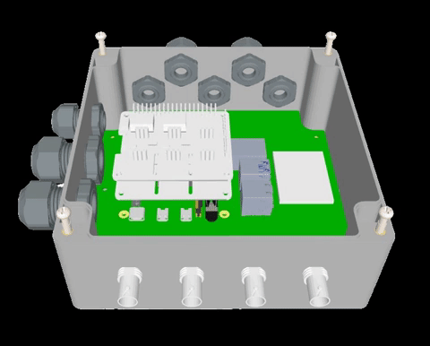

<h1 align="center">
   
  </a>
</h1>

<h2 align="center">PWO: Precision Water One</h2>

    <a href="https://www.whiteboxes.ch/docs/tentacle/t3-mkII/#/" style="text-decoration:none;">
    
      

  
    

---

## About
**Precision Water One (PWO)** is a smaller, versatile, cost-effective and energy efficient water quality monitoring system for industry, educational, and research applications. The solution will collect water quality, considering five parameters to start: Dissolved Oxygen (DO), Electric Conductivity (EC), PH+, Temperature, and Water Flow; with expansion capabilities to include other sensors.

## Overview and Background

> Contaminated water can transmit diseases such as diarrhea, cholera, dysentery, typhoid, and polio. [(World Health Organization)](https://www.who.int/news-room/fact-sheets/detail/drinking-water#:~:text=Key%20facts,at%20least%20a%20basic%20service.). Thus, the importance of ensuring water quality for everybody, keeping this technology open source becomes our best ally.

It is known that measuring and monitoring water quality parameters (DO, EC, PH+, among others) allow to mitigate the risks of contaminated water human ingestion.

### Hardware Components
To measure and monitor water quality with less human intervention. This project combines the following hardware components:

* Raspberry Pi 4 Board
* ESP32 Development Board
* Whitebox T3 (Atlas Scientific)
* High-Precision AD/DA Expansion Board 
* Water quality sensors.
* Waterproof IP65/66 case.

For more details, please refer to [Hardware Folder](https://github.com/zignartech/iotadd-pwo/tree/main/hardware)

### Software Components
The project integrates: 
* IOTA Streams API (developed by Zignar Technologies) which can be use to create authors/subscribers, and send/fetch messages to IOTA Tangle (blockchain).
* InfluxDB
* Grafana
* Node-RED
* MicroBlocks (ESP32 programming)
* Docker

For more details, plese refer to [Software Folder](https://github.com/zignartech/iotadd-pwo/tree/main/software)

## Standards

This project is based on [IOTA Streams Framework](https://www.iota.org/solutions/streams). The API Streams was developed using Rust Programming Language and the sensor reading was developed using Python. 

## Potential
All the components are Open Source to allow free usage and continuous improvements by the community. The first insitution who benefits from this project is Lethbridge College [(source)](https://blog.zignar.tech/research-collaboration-agreement-196051f3c3e6), but many other similar education institutions can be benefited as well.

## Future Steps

Regarding use cases, the next steps are:
* IOTA Decentralized Identity → for device identification. Also, to issue certifications for the students who have been trained about IOTA with this project.
* IOTA Non Fungible Tokens → to make the digital twin representation of each device unique, and to link the NFT metadata with a Data Stream.
* IOTA Smart contracts → to enable data commercialization from IoT devices.

Regarding the community, the next steps are:
* Increase colleges and other educational institutions using the technology.
* Reach non crypto communities of developers and engineers to present the project.
* Increase the number of individual developers engaged with the project.
