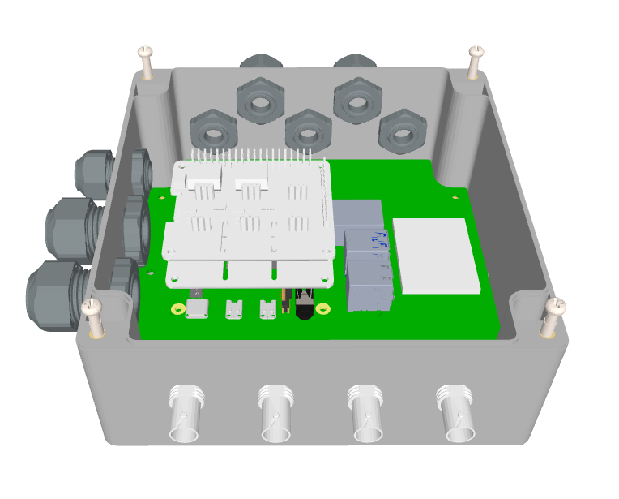

<h1 align="center">
   
  </a>
</h1>

<h2 align="center">PWOne</h2>

    <a href="https://www.whiteboxes.ch/docs/tentacle/t3-mkII/#/" style="text-decoration:none;">
    
      

  
    

      
Comming soon