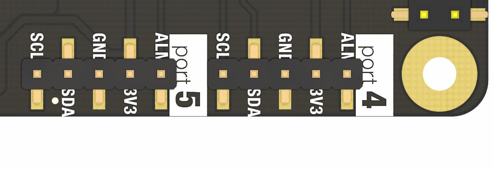
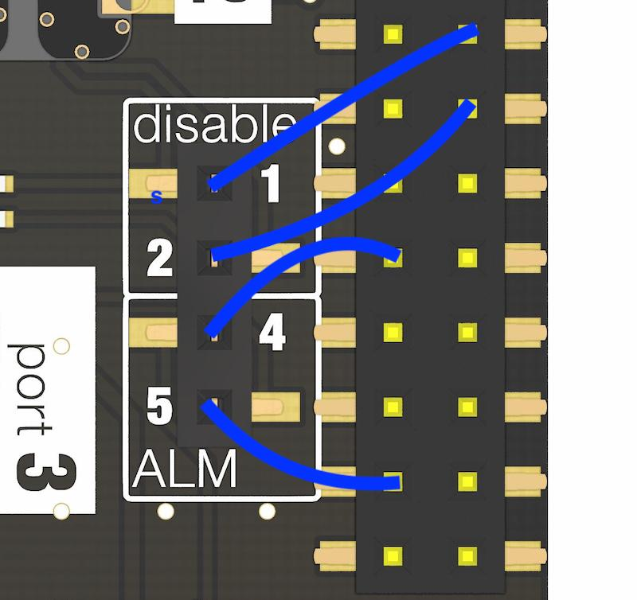

# Pinout - Whitebox T3

The Whitebox T3 connects to these Raspberry Pi pins

| Physical Pin | BCM pin |    Name    | on the Whitebox T3 |
| ------------ |:-------:|:----------:|:------------------:|
| 1            |   3V3   | 3.3V Power | Power ports 4 + 5  |
| 2            |   5V    |  5V Power  | Power ports 1 + 2  |
| 9            |   GND   |    GND     |        GND         |
| 3            |  BCM 2  |    SDA     |      I2C SDA       |
| 5            |  BCM 3  |    SCL     |      I2C SCL       |

The Whitebox T3 does not "occupy" any pin exclusively. The T3 is mostly transparent to other HATs - they can even be stacked on top and will work as usual.

## Port 1 + 2

* Isolation: Yes, full power and data isolation
* Footprint: EZO Circuit
* Protocol: `I2C` only
* Probe Connection: SMA (female)
* Best suited for:
    - `EZO pH`
    - `EZO ORP`
    - `EZO EC`
    - `EZO DO`
    - `EZO RTD` (no isolation needed)
* Voltages on the non-isolated (Raspberry Pi) side:
    - Vcc: `5V` 
    - I2C: `3.3V`
* Voltages on the isolated (EZO) side:
    - Vcc: `3.9`
    - I2C: `3.9`

## Port 3

* Isolation: No
* Footprint: EZO Circuit
* Protocol: I2C only
* Probe Connection: SMA (female)
* Best suited for:
    - EZO `RTD`
    - EZO `Flow`
    - VCC: `3.3V`
    - I2C: `3.3V`

## Port 4 + 5

* Isolation: No
* Footprint: EZO Data Connector (standard male 5 pin header, 2.54mm/0.1" spacing)
* Protocol: `I2C` only
* Best suited for:
    - 5pin EZO-Data devices like the EZO-PMP, EZO-CO2 or EZO-PRS
    - 3rd-party I2C devices like the I2C Soil Moisture Sensor
    - VCC: `3.3V`
    - I2C: `3.3V`

#### Pinout Port 4 + 5

* 3V3: 3.3V
* GND: GND
* SDA: I2C SDA
* SCL: I2C SCL
* ALM: Some devices from Atlas Scientific provide additional functionality (e.g. Alarms) to this pin. Both port 4 and 5 ALM pins are exposed in the configuration pins.

#### Configuration pins

Connect port configuration pins to your circuits or Raspberry GPIO pins.

#### Disable
The isolators in port 1 and 2 can be disabled. If disabled, the EZO circuit is cut from power.
* `1`: LOW/GND = port 1 is disabled. HIGH/3.3V = port 1 is enabled. NC = port 1 is on
* `2`: LOW/GND = port 2 is disabled. HIGH/3.3V = port 2 is enabled. NC = port 2 is on

#### ALM
* `4`: port 4 ALM pin
* `5`: port 5 ALM pin

