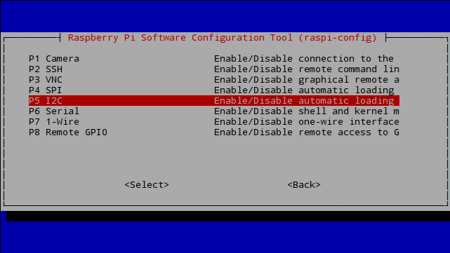
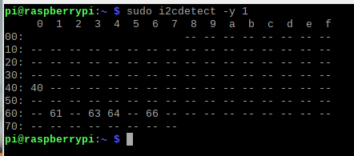

# Quickstart Tutorial - Whitebox T3

<h1 align="center">
  </a>
</h1>

## Prerequisites

For this quickstart tutorial you need:
* One or more EZO Circuits by Atlas Scientific, protocol set to `I2C`
* A Raspberry Pi (2, 3, 4, Zero - see Compatibility for a full list)
* A [Whitebox T3 for Raspberry Pi](https://atlas-scientific.com/electrical-isolation/whitebox-t3/)

> I2C only The Whitebox T3 works with EZO circuits in I2C mode only. Before using your EZO Circuits with the Whitebox T3, switch them to I2C. How to switch EZO Circuits to I2C

## Preparing the Raspberry Pi

> Don't mount the Whitebox T3 to the Raspberry Pi yet

1. Download a recent version of [Raspberry Pi OS (64-bit)](https://www.raspberrypi.com/software/operating-systems/).
2. Burn the img-file to an SD card, e.g. using [Raspberry Pi Imager](https://www.raspberrypi.com/software/) (for Windows, OSX, Linux).
3. Boot your Pi (the Whitebox T3 still not connected)
4. Use the terminal to start the `raspi-config` tool:

```
sudo raspi-config
```
5. In the menu, find the option to activate `I2C`. 

<h1 align="center">
  </a>
</h1>

* At the time of writing this is under `5 Interfacing Options` > `P5 I2C`

1. Enable `I2C`
2. Reboot your Pi
3. Upgrade the system packages:

```
sudo apt-get update
sudo apt-get upgrade
```
4. Install the I2C tools:

```
sudo apt-get install i2c-tools
```
5. Reboot your Pi

## Prepare the hardware

> Your Raspberry Pi is powered off

1. All your EZO devices must be in I2C mode. How to switch EZO Circuits to I2C.
2. Mount the supplied pcb standoffs to the Whitebox T3 for stability.
3. Mount the stacking pin header to the T3 from the bottom side.
4. Plug your EZO circuits into the Whitebox T3.
5. **Double-check the correct circuit orientation.**
6. Power up the Raspberry Pi.

## Test I2C

In the terminal, type

```
sudo i2cdetect -y 1
```
you will see all your I2C devices in the table.

<h1 align="center">
  </a>
</h1>

> When the screenshot was taken, an EZO pH Circuit (0x63), an EZO DO Circuit (0x61) and a HDC1008 humidity sensor (0x42) have been connected to the Raspbyerry Pi.

#### Default I2C Addresses:

* EZO DO: **97** *(0x61)*
* EZO pH: **99** *(0x63)*
* EZO EC: **100** *(0x64)*
* EZO RTD: **102** *(0x66)*
* SHT21: **64** *0x40*

[Buy](https://atlas-scientific.com/electrical-isolation/whitebox-t3/)