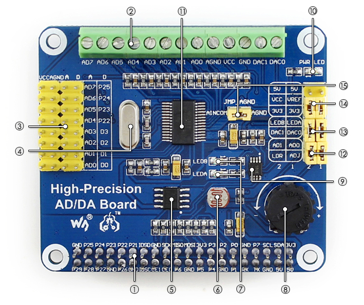

# High-Precision AD/DA Expansion Board

### Documents
* 

### Description

There's no AD/DA function on the Raspberry Pi GPIO interface, this may trouble you in the Pi development. However, it won't be a problem anymore. The High-Precision AD/DA Board allows you to add high-precision AD/DA functions to the Raspberry Pi.

### FEATURES

* Standard Raspberry Pi 40PIN GPIO extension header, supports Raspberry Pi series boards, Jetson Nano
* Onboard ADS1256, 8ch 24bit high-precision ADC (4ch differential input), 30ksps sampling rate
* Onboard DAC8532, 2ch 16bit high-precision DAC
* Onboard input interface via pinheaders, for connecting analog signal
* the pinout is compatible with Waveshare sensor interface standard, easy to connect various analog sensor modules
* Onboard input/output interface via screw terminals, for connecting analog/digital signal
* Features AD/DA detect circuit, easy for signal demonstration

### What's on Board

<h1 align="center">
  </a>
</h1>

1. Raspberry Pi GPIO interface : for connecting with the Pi
2. AD/DA input/output : screw terminals
3. AD input : pinheaders, the pinout is compatible with Waveshare sensor interface standard, easy to connect various analog sensor modules
4. 7.68M crystal
5. LM285-2.5 : provides reference voltage for the ADC chip
6. Photo resistor
7. LED output indicator
8. 10K potentiometer
9. DAC8532 : 16bit high-precision DAC, 2ch
10. Power indicator
11. ADS1256 : 24bit high-precision ADC, 8ch (4ch differential input)
12. ADC testing jumper
13. DAC testing jumper
14. Power selection jumper
15. ADC reference ground configuration : when AD single inputted, the AINCOM is reference terminal, can be connected to GND or external reference voltage

### Interface Definition

| Pin                           |          Symbol          |  Description   |
|:----------------------------- |:------------------------:| --- |
| 1, 17                         |       3.3V        |     	Power supply (3.3V) |
| 2, 4              |          <10mA           |   	Power supply (5V)   |
| 3, 5, 7, 8, 10, 18, 22, 24, 26, 27, 28, 29, 32, 36, 38, 40 |        	NC        |  NC   |
| 6, 9, 14, 20, 25, 30, 34, 39    |         GND         |  Ground   |
|11           | DRDY |  ADS1256 data ready output, low active   |
| 12            | RESET  |  ADS1256 reset input   |
| 13       |          PDWN            |  ADS1256 sync/power off input, low active   |
| 15    |          CS0           |   ADS1256 chip select, low active  |
| 16                       |          CS1           |  DAC8532 chip select, low active   |
| 19                |           DIN            |   SPI data input  |
| 21          |        DOUT         |  SPI data output   |
| 23                   |  SCK  |   	SPI clock   |
| 31, 33, 35, 37                        |      GPIO      |    	extend to sensor interface  |

[Buy](https://www.pishop.ca/product/raspberry-pi-high-precision-adda-expansion-board/)
