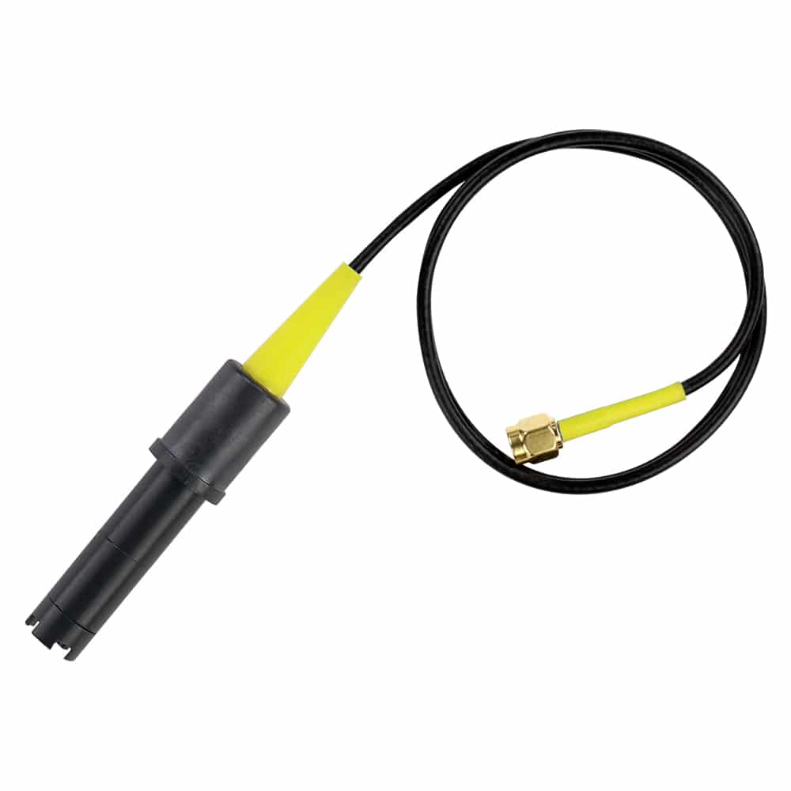

# Mini Lab Grade Dissolved Oxygen Probe

### Documents
* 
* 

### Description

The Atlas Scientific Mini Lab Grade Dissolved Oxygen probe is one of many unique products you will only find at Atlas Scientific. Designed for small spaces, this small probe gives you the same quality readings found in our lab-grade Dissolved Oxygen just smaller.  Because smaller probes use fewer precious metals, we can get the price lower. Keep in mind; smaller probes hold less electrolyte. Because of this, they need to be refilled more frequently than full-size or industrial probes.

### Specifications

| Reads                       | Dissolved Oxygen  |
|:--------------------------- |:-----------------:|
| Range                       |    1 − 50 mg/L    |
| Accuracy                    |   +/– 0.2 mg/L    |
| Response time               | ~0.5 mg/L/per sec |
| Temperature range °C        |     1 − 50 °C     |
| Max pressure                | 689 kPa (100PSI)  |
| Max depth                   |   70m (230 ft)    |
| Connector                   |     Male SMA      |
| Cable length                |    45cm (18″)     |
| Internal temperature sensor |        No         |
| Time before recalibration   |     ~6 Months     |
| Life expectancy             |     2.5 Years     |
| Maintenance                 |     ~6 Months     |

[Buy](https://atlas-scientific.com/probes/mini-d-o-probe/)
