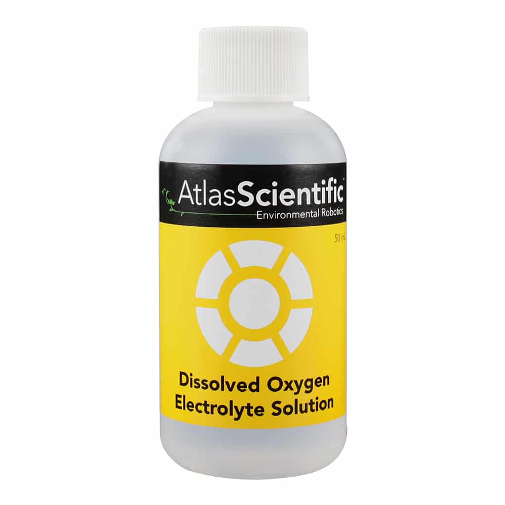

# Replacement Dissolved Oxygen Electrolyte Solution

<h1 align="center">
  </a>
</h1>

### Documents
* [ Dissolved Oxygen Electrolyte Solution Instructions](./do_electrolyte_solution_instructions.pdf)
* [ Dissolved Oxygen Electrolyte Solution SDS](./Dissolved-Oxygen-Electrolyte-Solution-SDS.pdf)

### Description

As a Dissolved Oxygen probe ages, its output signal starts to get weaker. Eventually, you will start to see that the readings are lower than normal. This usually means that it’s time to replace the probes electrolyte solution. Where could you possibly find Dissolved Oxygen Probe Electrolyte Solution? My friend, look no further. This electrolyte solution will work for any galvanic D.O. probe regardless of brand or manufacturer.

### Specifications

* 50mL of Dissolved Oxygen Electrolyte Solution 
* 3mL syringe included

This product is used to replace the electrolyte solution inside the dissolved oxygen probe. This solution can refill up to 25 dissolved oxygen probes.

[Buy](https://atlas-scientific.com/calibration-solutions/dissolved-oxygen-electrolyte-solution/)

