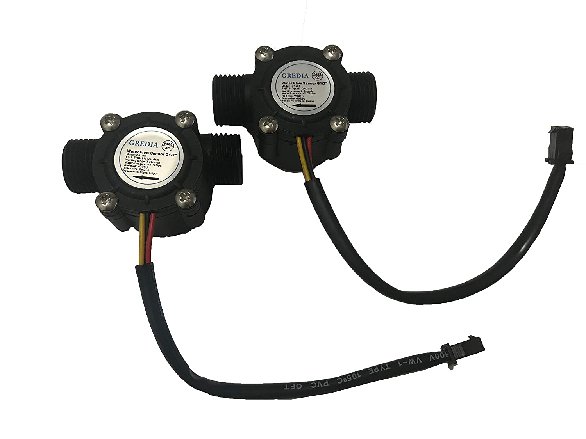
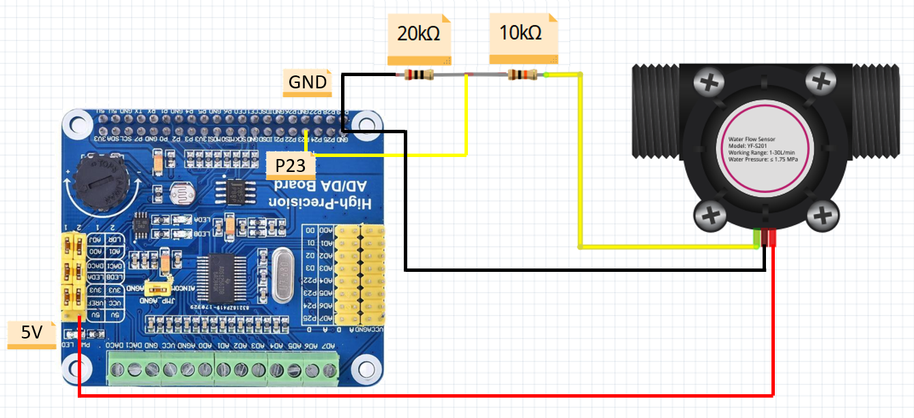

# Water Flow

### Documents
* [Water flow datasheet](./Water_flow_sensor_datasheet.pdf)

### Description

* This sensor is used to measure water flow in coffee machine, water heater, water purifier, drinking fountain, beverage machine, campus smart card equipment, etc.

### Specifications

| Parameter                         | Value |
|:----------------------------- |:------------------------:|
| Flow range                         |       1-30L/min        |
| Water Pressure               |          <10mA           |
| Working voltage |       DC 5-24 V        |
| F    |         （7.5*Q)±2%         |
| Q            | L/Min |

Material: food grade plastic, all raw materials conform to the ROHS test standard

[Buy](https://www.amazon.ca/GREDIA-Sensor-Food-Grade-Flowmeter-Counter/dp/B07RG4KXWJ/ref=pd_di_sccai_2?pd_rd_w=WWkZ5&pf_rd_p=e92f388e-b766-4f7f-aac1-ee1d0056e8fb&pf_rd_r=YW5KCVFF8P890BV0YA7D&pd_rd_r=8acc75b8-890a-4df6-9636-58365518565f&pd_rd_wg=C4FnG&pd_rd_i=B07RG4KXWJ&th=1)

### Connections

