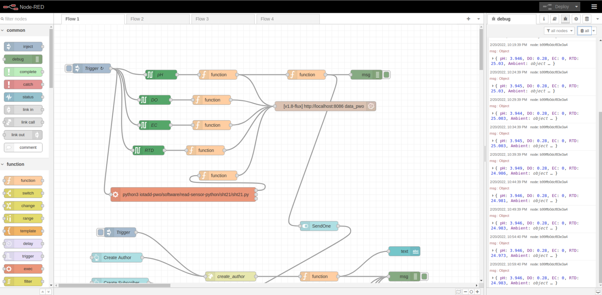
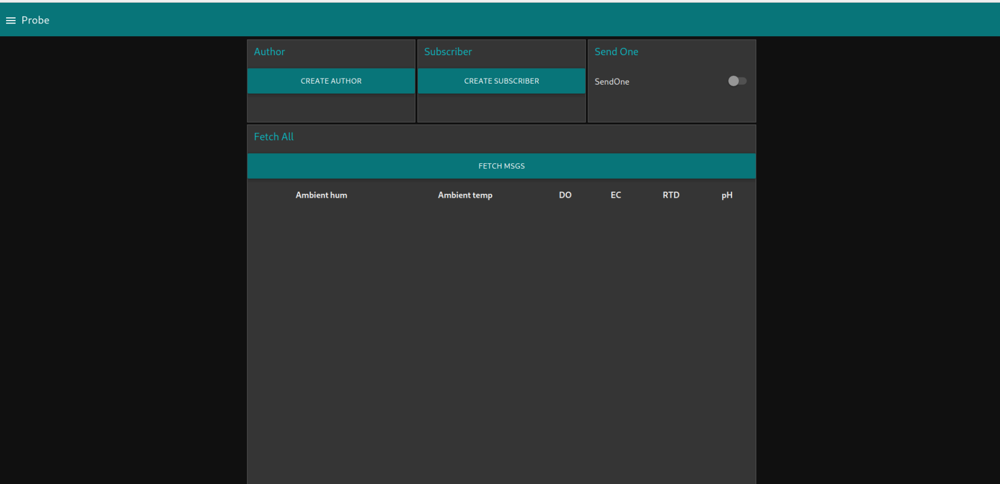
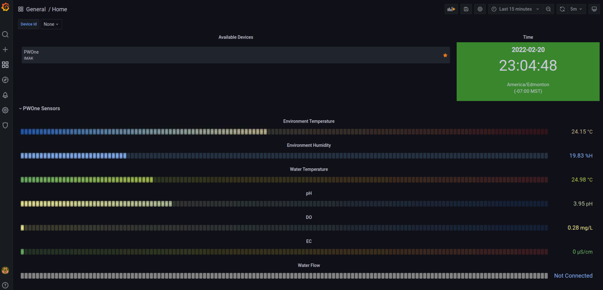

# Quick Starter

* Use image => [Raspberry Pi OS (64-bit)](https://www.raspberrypi.com/software/operating-systems/)

1. [Setup Hardware](https://github.com/zignartech/iotadd-pwo/tree/main/hardware/sensors)
2. [Test I2C](https://github.com/zignartech/iotadd-pwo/tree/main/hardware/pi-hat/1-whitebox-t3)
3. [Setup Docker and Services](https://github.com/zignartech/iotadd-pwo/tree/main/software/docker-compose)
4. [Setup Node-RED](https://github.com/zignartech/iotadd-pwo/tree/main/software/node-red)
5. [Install this package for SHT20](https://github.com/zignartech/iotadd-pwo/tree/main/software/read-sensor-python/sht21)

### Node-RED

- Link => http://localhost:1880

### Node-RED Dashboard

- Link => http://localhost:1880/ui

### Grafana Dashboard

- Link => http://localhost:3000

