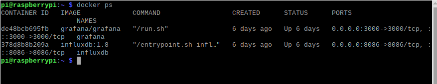

# Install docker and docker-compose

## OS requirements

To install Docker Engine, you need the 64-bit version of one of these Debian or Raspbian versions:

* Raspbian Bullseye 11 (stable)
* Raspbian Buster 10 (oldstable)

## Lets first upgrade the packages on our system:

```
sudo apt update && apt upgrade -y
```

## Install using the convenience script

This example downloads the script from get.docker.com and runs it to install the latest stable release of Docker on Linux:

```
curl -fsSL https://get.docker.com -o get-docker.sh

sudo sh get-docker.sh
```
## Add user to docker
```
sudo usermod -aG docker $USER
```
exit the console and re-enter or logout

## Check whether docker is running by executing `docker ps`:

```
docker ps
```

## Install Docker Compose

Install using pip

```
pip3 install docker-compose
```

## verify docker compose installed

```
docker-compose --version
```
> docker-compose version 1.29.2, build 5becea4c


## Running the Services

the folder where the `docker-compose.yml` resides, simply execute:

```
docker-compose up -d
```
## You should see your container running now:

```
docker ps
```
