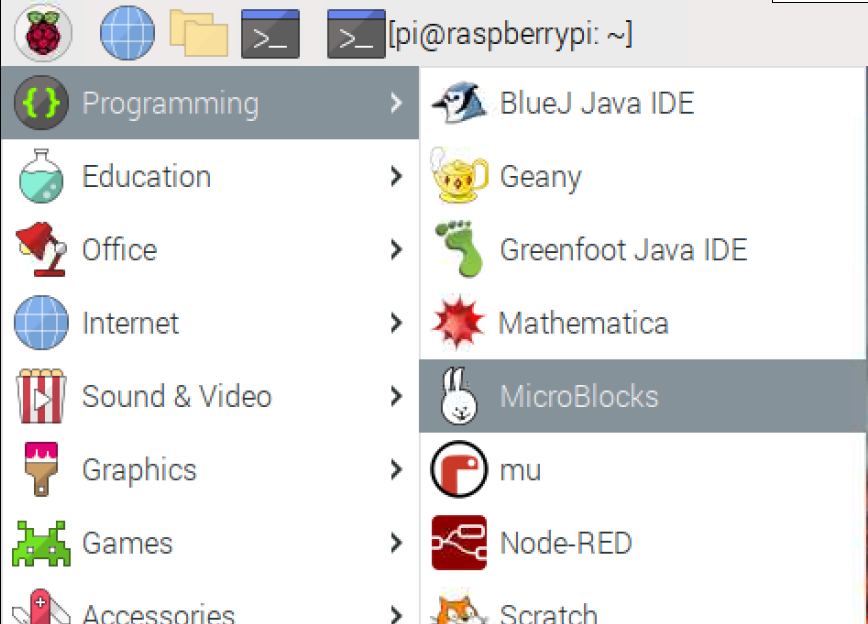
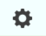
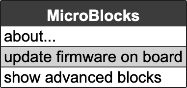
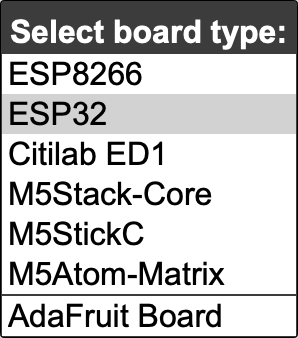
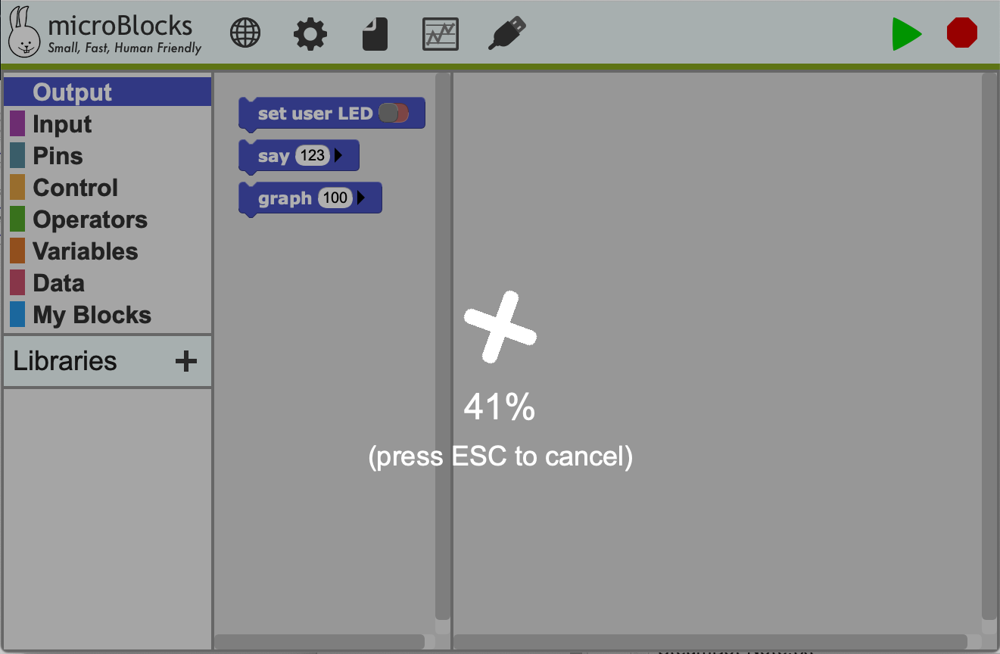

# MicroBlocks on Raspberry pi

## Set up your Raspberry pi to use MicroBlocks

Go to the [Download](https://microblocks.fun/releases) page and click the **Raspberry pi (Raspbian)** button.

The first time you install MicroBlocks you must reboot. The installer adds the user to the access group for the serial port, but that change does not take effect until the next reboot.

Open a terminal and run (for 64-bit):

```
sudo dpkg -i ~/Downloads/ublocks-amd64.deb
```

or (for 32-bit):

```
sudo dpkg -i ~/Downloads/ublocks-armhf.deb
```

If MicroBlocks does not connect to your board, make sure that you rebooted after running the installer. Then run:

```
groups
```

to verify that you are in the **dialout** and **tty** groups.

[Reference](https://microblocks.fun/get-started)

## Open MicroBlocks

* **Raspberry**>>**Programming**>>**MicroBlocks**



## Set up ESP32 Boards

These notes are for users who want to work with MicroBlocks on ESP32 boards and are comfortable with the extra technical challenges involved.

The ESP32 from Espressif Systems combines a 32-bit dual-core processor with WiFi and Bluetooth functionality and a set of IO pins. Basic ESP32 boards don't have many built in capabilities (just a user LED) so most interesting applications require connecting external components. The need for wiring makes basic ESP32 boards less appropriate for younger children and beginners than boards with more built-in features.

#### Installing MicroBlocks Firmware

To install the MicroBlocks firmware on an ESP32 board, launch MicroBlocks and plug in the board. From the MicroBlocks (gear) menu, select "install firmware on board":






Then select "ESP32":



As the firmware loads, you will see a progress screen:



Once the firmware is installed, a green circle should appear to show that the board is connected.


That may take a few seconds. In rare cases you may need to disconnect and reconnect the board.

To verify that everything is working, try the following:


The LED on your board should light up, showing that the board is connected.

If the LED on your board does not light up, it could be that the LED is connected to a different pin on your board. (Different ESP32 boards connect the user LED to different pins.) You could look up the LED pin number in the data sheet for your board, but it's more fun to write a MicroBlocks program to find it for you:


You're ready to code!