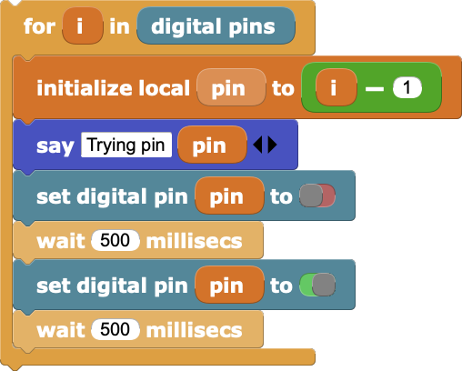

# Running MicroBlocks in the Browser

As of MicroBlocks 0.5, MicroBlocks runs in Chromium-based web browsers, either Google's Chrome browser or recent versions of MicroSoft's Edge. (Each of them offers an experimental Chromium feature known as "WebSerial API" to communicate with the microcontroller.) This can be helpful in school, library, and other settings where it is difficult to install application programs.
As long as the computer has one of the supported browsers and a USB port, you can run MicroBlocks!

## Running MicroBlocks

To run MicroBlocks in the browser visit:

=> https://microblocks.fun/run/microblocks.html

Note: Be sure to use HTTPS, not HTTP, otherwise MicroBlocks won't be able to connect to the microcontroller.

## Set up ESP32 Boards

These notes are for users who want to work with MicroBlocks on ESP32 boards and are comfortable with the extra technical challenges involved.

The ESP32 from Espressif Systems combines a 32-bit dual-core processor with WiFi and Bluetooth functionality and a set of IO pins. Basic ESP32 boards don't have many built in capabilities (just a user LED) so most interesting applications require connecting external components. The need for wiring makes basic ESP32 boards less appropriate for younger children and beginners than boards with more built-in features.

#### Installing MicroBlocks Firmware

To install the MicroBlocks firmware on an ESP32 board, launch MicroBlocks and plug in the board. From the MicroBlocks (gear) menu, select "install firmware on board":

Then select "ESP32":

As the firmware loads, you will see a progress screen:

Once the firmware is installed, a green circle should appear to show that the board is connected.

That may take a few seconds. In rare cases you may need to disconnect and reconnect the board.

To verify that everything is working, try the following:

The LED on your board should light up, showing that the board is connected.

If the LED on your board does not light up, it could be that the LED is connected to a different pin on your board. (Different ESP32 boards connect the user LED to different pins.) You could look up the LED pin number in the data sheet for your board, but it's more fun to write a MicroBlocks program to find it for you:

You're ready to code!