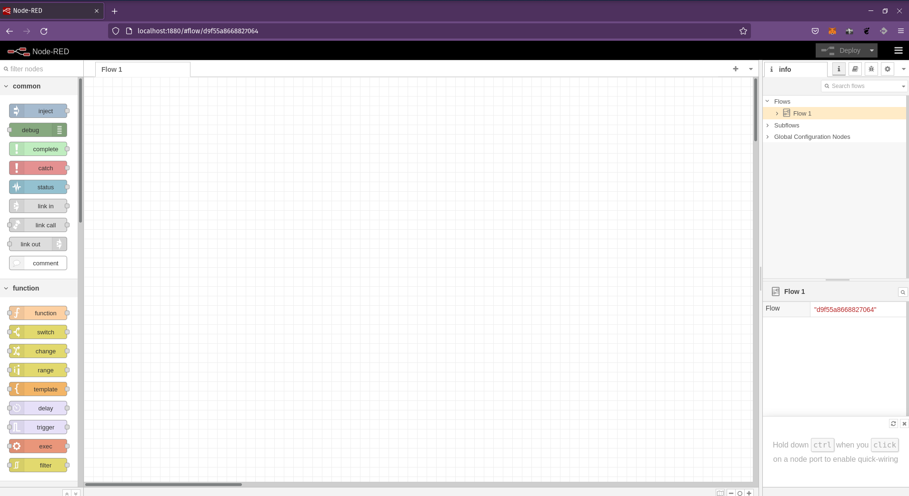
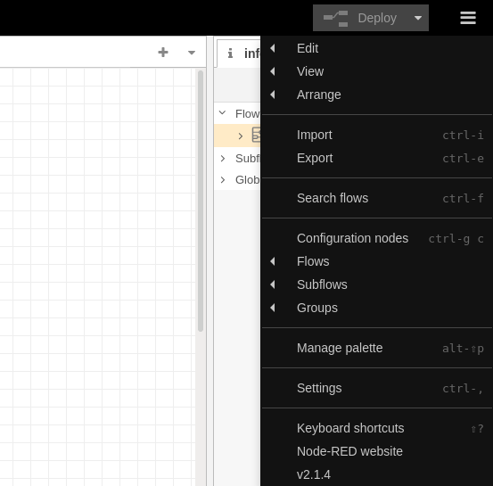
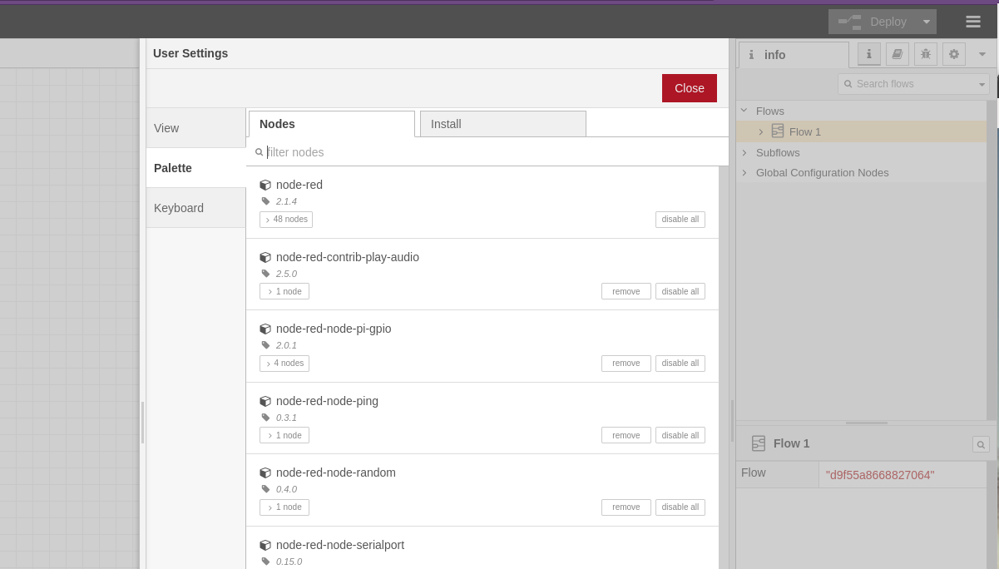
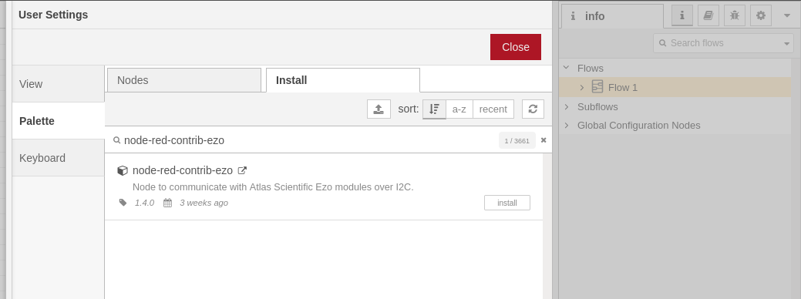
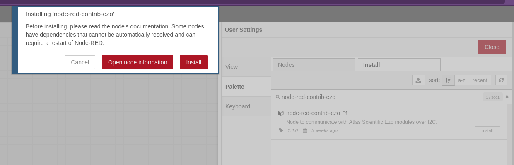
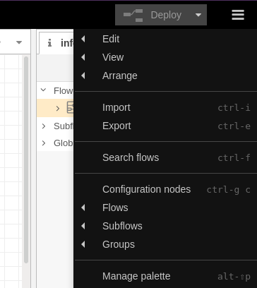
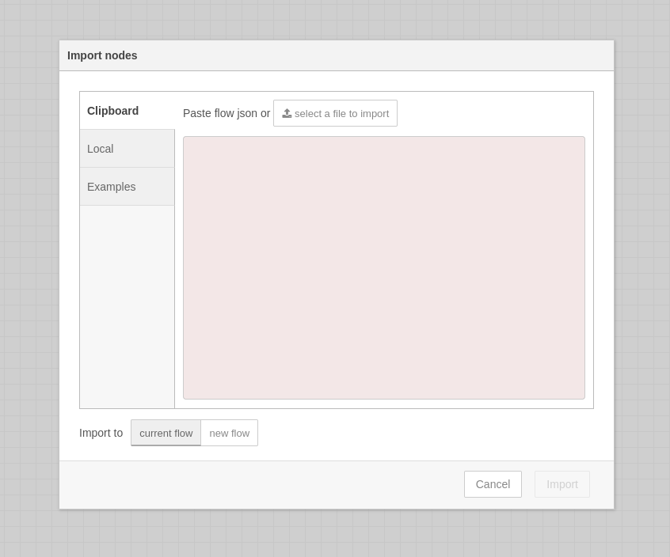
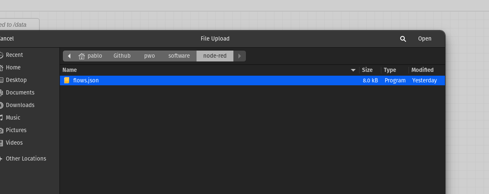
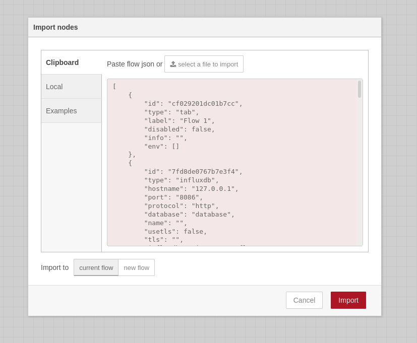
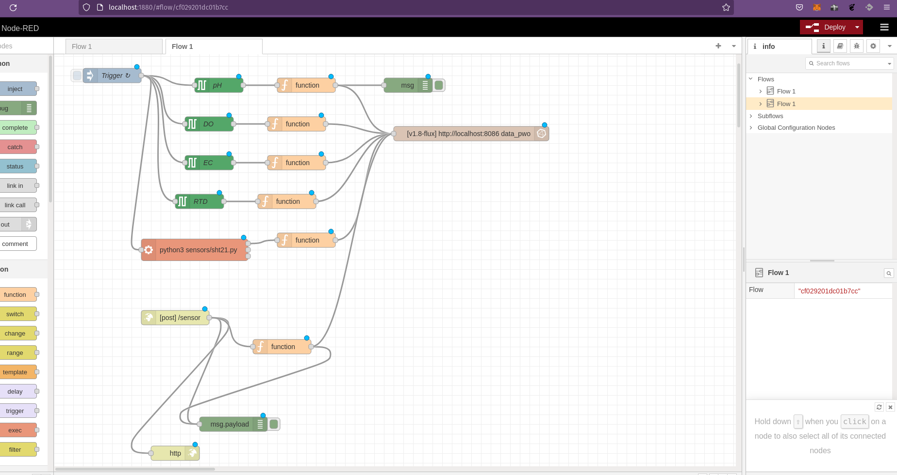

# Node-RED - Running on Raspberry Pi

## Installing and Upgrading Node-RED

Running the following command will download and run the script. If you want to review the contents of the script first, you can view it on Github.

```
bash <(curl -sL https://raw.githubusercontent.com/node-red/linux-installers/master/deb/update-nodejs-and-nodered)
```
There are extra parameters you can pass to the script. Add --help to the above command to see them.

>  This script will work on any Debian-based operating system, including Ubuntu and Diet-Pi. You may need to run `sudo apt install build-essential git curl` first to ensure npm is able to fetch and build any binary modules it needs to install. 

This script will:


* Remove the existing version of Node-RED if present.
* If it detects Node.js is already installed, it will ensure it is at least v12. If less than v12 it will stop and let the user decide whether to stay with Node-RED version 1 - or upgrade Nodejs to a more recent LTS version. If nothing is found it will install the current Node.js LTS release using the NodeSource package.
* Install the latest version of Node-RED using npm.
* Optionally install a collection of useful Pi-specific nodes.
* Setup Node-RED to run as a service and provide a set of commands to work with the service.

> Node-RED has also been packaged for the Raspberry Pi OS repositories and appears in their list of 'Recommended Software'. This allows it to be installed using `apt-get install nodered` and includes the Raspberry Pi OS-packaged version of Node.js, but does not include npm.

While using these packages is convenient at first, we strongly recommend using the install script above instead.


## Running as a service

The following commands are provided to work with the service:

* `node-red-start` - this starts the Node-RED service and displays its log output. Pressing Ctrl-C or closing the window does not stop the service; it keeps running in the background
* `node-red-stop` - this stops the Node-RED service
* `node-red-restart` - this stops and restarts the Node-RED service
* `node-red-log` - this displays the log output of the service

You can also start the Node-RED service on the Raspberry Pi OS Desktop by selecting the `Menu -> Programming -> Node-RED` menu option.

Autostart on boot

If you want Node-RED to run when the Pi is turned on, or re-booted, you can enable the service to autostart by running the command:
```
sudo systemctl enable nodered.service
```
To disable the service, run the command:

```
sudo systemctl disable nodered.service
```

#### For the project we recommend running the following command in the console

```
sudo systemctl enable nodered.service
```

## Opening the editor

Once Node-RED is running you can access the editor in a browser.

If you are using the browser on the Pi desktop, you can open the address: http://localhost:1880.

When browsing from another machine you should use the hostname or IP-address of the Pi: `http://<hostname>:1880`. You can find the IP address by running hostname -I on the Pi.



## Install Nodes Using Node-RED UI

Perform below listed steps to search and add a node to your node-RED instance.

* Click on the menu icon (3 lines) on top right corner of the page.
* Now, click on Manage palette option
* Nodes tab will show all the palettes / nodes you have installed.
* Click on Install tab. This is where we can search for wide range of nodes from the community.
* Type the search query and you will have the matching results.
* Click on install button and the confirmation button of the node you want to be installed.
* This will install the node in Node-RED.

#### Install three required palettes

* Menu and Manage palette



* The palettes and Click on Install tab



* Type the search query, install and confirmation

1.  Install node-red-contrib-ezo
2.  Install node-red-contrib-influxdb
3.  Install node-red-dashboard

* Example: node-red-contrib-ezo

    - Click on install


## Importing Flows

Flows can be imported and exported from the editor using their JSON format, making it very easy to share flows with others.

#### Importing required flows

The Import dialog can be used to import a flow by the following methods:

* Click on the menu icon (3 lines) on top right corner of the page.
* Now, click on Import option


* Click on Select a file to Import

* Select the file flows.json and upload

* Click on Import

* Then, click on Deploy



