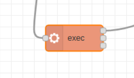
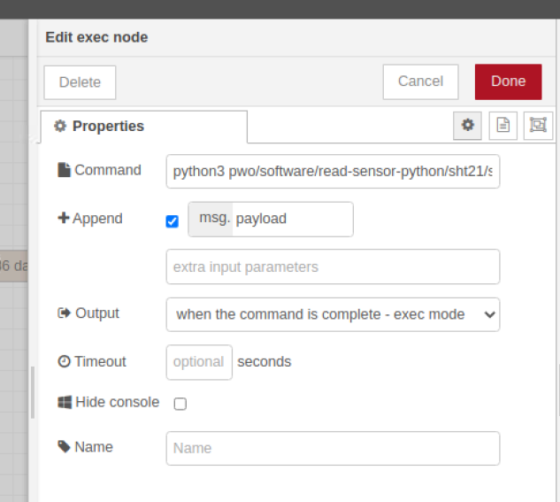

# Raspberry Pi Sensors - SHT21

This is a **Python 3** package that enables **Raspberry Pi** to read various
sensors.

Supported devices include:
- **DS18B20** temperature sensor
- **BMP180** pressure and temperature sensor
- **HTU21D** humidity and temperature sensor
- **SHT20** humidity and temperature sensor
- **MCP3004** A/D Converter (**MCP3008** also compatible)

## Installation

It is best to update Linux first.

`sudo apt-get update`  
`sudo apt-get dist-upgrade`

Install this package:

`sudo pip3 install sensor`

But the `sensor` package would not work by itself. Communicating with sensors
often requires some sort of serial protocol, such as **1-wire**, **I2C**, or
**SPI**. You have to know which sensor speaks which, and set up Raspberry Pi to
do so.

## Enable 1-Wire, I2C, or SPI

`sudo raspi-config`, enter **Interfacing Options**, enable the protocols you
need.

## Know your sensor's address

Unlike many libraries out there, this library knows **no default bus number**
and **no default device address**. I want learners to be explicitly aware of
those numbers, even if they are fixed.

For example:
- **I2C** bus is numbered **1**
- **SPI** bus is numbered **0**

To find out individual sensor's address:
- For 1-wire sensors, go to `/sys/bus/w1/devices/`
- For I2C sensors, use `sudo i2cdetect -y 1`
- For SPI sensors, you should know which CS pin you use

## My sensors don't give simple numbers

Unlike many libraries out there, this library does not return a simple Celcius
degree when reading temperatures, does not return a simple hPa value when
reading pressure, does not return a simple RH% when reading humidity, etc.
Instead, I return a **namedtuple** representing the quantity, which offers two
benefits:

- No more conversion needed. Suppose you get a *Temperature* called `t`, you may
  access the Celcius degree by `t.C` as easily as you do Fahrenheit by `t.F`.
- Namedtuples may have methods. For example, a *Pressure* has a method called
  `altitude()`, which tells you how high you are above mean sea level.


## SHT20

- Humidity + Temperature, I2C
- Use `sudo i2cdetect -y 1` to check address. It is probably `0x40`.

```python
from sensor import SHT20

# I2C bus=1, Address=0x40
sht = SHT20(1, 0x40)

h = sht.humidity()  # read humidity
print(h)            # namedtuple
print(h.RH)         # relative humidity

t = sht.temperature()  # read temperature
print(t)               # namedtuple
print(t.C)             # Celsius

h, t = sht.all()  # read both at once
```

[Reference](https://github.com/nickoala/sensor)

## Getting data in Node-RED

Open a terminal and locate the directory where the `sht21.py` file.


In the Node-RED dashboard, double click on the `exec` node.



In the `Command` section, write the python3 command first, then the location of the `sht21.py` file. Click on Done

Example:

```
python3 pwo/software/read-sensor-python/sht21/sht21.py
```



